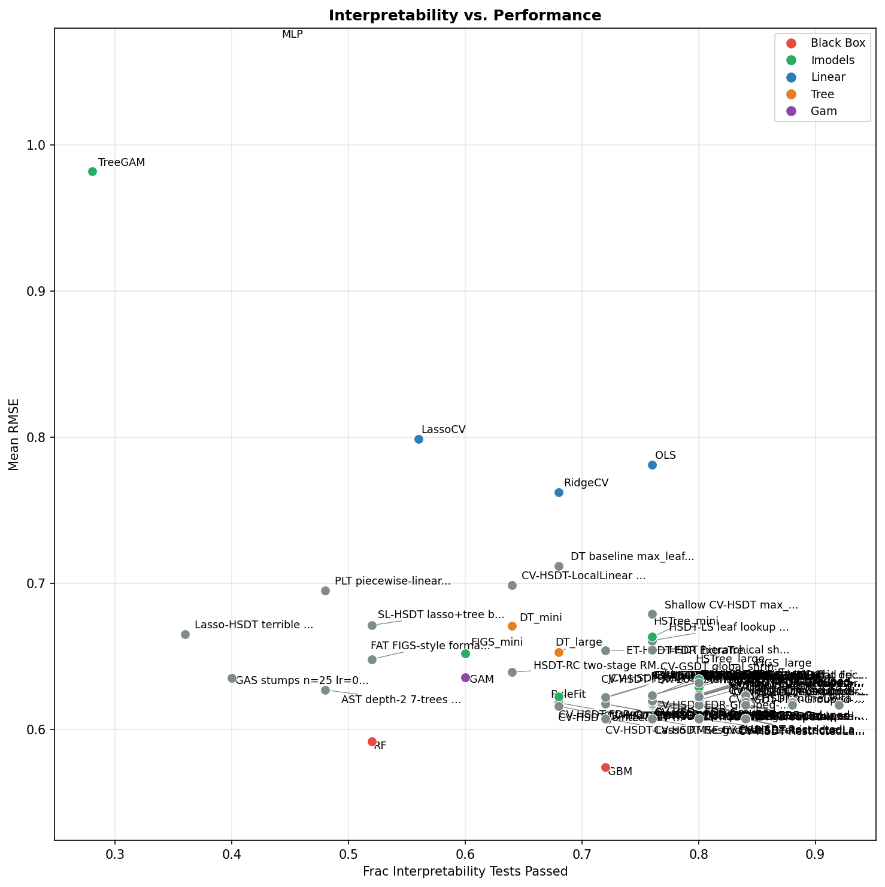

# Results Report

## Part 1: Interpretability Evaluation

### Overview

The interpretability evaluation (`eval/interp_eval.py`) tests whether an LLM (GPT-4o) can extract meaningful, usable information from a model's **string representation** alone. Each test follows this protocol:

1. Generate a small synthetic dataset with a known ground truth structure (e.g., a single dominant feature, a threshold, a signed coefficient).
2. Fit a fresh clone of the model under test on that dataset.
3. Convert the fitted model to a human-readable string via `get_model_str()`.
4. Prompt GPT-4o with the model string and a focused question (e.g., "which feature is most important?").
5. Parse the LLM's response and compare it to the known ground truth; mark as **pass** or **fail**.

The 25 tests are divided into four suites:

| Suite | # Tests | What it probes |
|-------|---------|----------------|
| **Standard** (8) | Basic readability | Can the LLM identify dominant features, predict outputs, determine direction/sign of effects? |
| **Hard** (5) | Quantitative precision | Multi-feature prediction, pairwise comparisons, tight numerical tolerances |
| **Insight** (6) | Structural understanding | Sparse feature detection, nonlinear thresholds, simulatability, counterfactual targets |
| **Discrim** (6) | Degree of interpretability | Discriminates interpretable from black-box models; penalizes complexity |

---

### Detailed Example: `most_important_feature` (Standard Suite)

```python
def test_most_important_feature(model, llm):
    # 1. Create synthetic data: y = 10·x0 + noise  (x1–x4 are irrelevant)
    rng = np.random.RandomState(0)
    X = rng.randn(300, 5)          # 5 features
    y = 10.0 * X[:, 0] + rng.randn(300) * 0.5

    # 2. Fit model
    m = clone(model)
    m.fit(X, y)

    # 3. Convert to string
    model_str = get_model_str(m, feature_names=["x0","x1","x2","x3","x4"])

    # 4. Ask LLM
    prompt = (
        "Here is a trained regression model:\n\n"
        + model_str
        + "\n\nWhich single feature is most important for predicting the output? "
          "Answer with just the feature name (e.g., 'x0', 'x3')."
    )
    response = llm(prompt)

    # 5. Check: pass if response contains "x0"
    passed = "x0" in response.lower()
    return dict(test="most_important_feature", passed=passed,
                ground_truth="x0", response=response)
```

**Ground truth:** `x0` (coefficient = 10; all other features have coefficient 0).
**Pass criterion:** The LLM's response contains the string `"x0"`.
**Result:** Every model except TreeGAM passed — this is the easiest test and all well-formed model strings highlight x0's dominance.

---

### Test Results Table

The table below covers all 25 core tests. "Pass rate" is the fraction of the 15 models that passed. The final column lists models that passed (✓).

| Suite | Test name | Short description | Detailed description | Pass rate | Models that passed |
|-------|-----------|-------------------|----------------------|-----------|-------------------|
| standard | `most_important_feature` | Identify dominant feature | Data: y=10·x0+ε, 4 irrelevant features. Ask: which single feature matters most? | **1.00** | GAM, DT_mini, DT_large, OLS, LassoCV, RidgeCV, RF, GBM, MLP, FIGS_mini, FIGS_large, RuleFit, HSTree_mini, HSTree_large |
| standard | `feature_ranking` | Rank top-3 features | Data: y=5·x0+3·x1+1.5·x2, x3/x4 zero. Ask: rank 3 most important features. Pass if x0 before x1 in response. | **1.00** | GAM, DT_mini, DT_large, OLS, LassoCV, RidgeCV, RF, GBM, MLP, FIGS_mini, FIGS_large, RuleFit, HSTree_mini, HSTree_large, TreeGAM |
| standard | `direction_of_change` | Sign of prediction shift | Data: y=8·x0+ε. Ask: how much does prediction change when x0 goes 0→1? Pass within 25% tolerance. | **0.93** | GAM, DT_mini, DT_large, OLS, LassoCV, RidgeCV, RF, GBM, MLP, FIGS_mini, FIGS_large, RuleFit, HSTree_mini, HSTree_large |
| standard | `sign_of_effect` | Sign of negative coefficient | Data: y=5·x0−5·x1, ask: by how much does prediction change when x1 increases by 1? | **0.87** | GAM, DT_mini, DT_large, OLS, LassoCV, RidgeCV, MLP, FIGS_mini, FIGS_large, RuleFit, HSTree_mini, HSTree_large, TreeGAM |
| standard | `counterfactual_prediction` | Extrapolate from given prediction | Given that model predicts P for x0=1, what does it predict for x0=3? Pass within 25% tolerance. | **0.80** | DT_large, OLS, LassoCV, RidgeCV, RF, GBM, MLP, FIGS_mini, FIGS_large, HSTree_mini, HSTree_large, TreeGAM |
| standard | `discrim_compactness` | Is model compact? | Ask: can the model be computed in ≤10 rules/ops? Designed to distinguish sparse from black-box models. | **0.80** | DT_mini, DT_large, OLS, LassoCV, RidgeCV, RF, GBM, MLP, FIGS_large, RuleFit, HSTree_large, TreeGAM |
| standard | `discrim_predict_above_threshold` | Predict above-threshold sample | Threshold data (threshold=1.0); ask prediction for x0=2.0 (clearly above). | **0.82** | GAM, DT_mini, DT_large, RF, GBM, FIGS_mini, FIGS_large, HSTree_mini, HSTree_large |
| standard | `discrim_simulate_all_active` | Simulate complex 5-feature sample | All five features active at non-round values; ask exact prediction. Tests simulatability. | **0.93** | GAM, DT_mini, OLS, LassoCV, RidgeCV, RF, GBM, MLP, FIGS_mini, FIGS_large, RuleFit, HSTree_mini, HSTree_large |
| standard | `discrim_dominant_feature_sample` | Dominant feature for a specific sample | x0 coefficient ≈7, value=2.0; other features negligible. Ask which feature contributes most for that sample. | **1.00** | GAM, DT_mini, DT_large, OLS, LassoCV, RidgeCV, RF, GBM, MLP, FIGS_mini, FIGS_large, RuleFit, HSTree_mini, HSTree_large, TreeGAM |
| standard | `irrelevant_features` | Identify zero-effect features | Data: only x0 matters; ask which features have little or no effect. Pass if ≥2 of x1–x4 are named. | **0.60** | GAM, OLS, LassoCV, RidgeCV, RF, GBM, MLP, FIGS_large, RuleFit |
| standard | `point_prediction` | Predict numerical output | Data: y=5·x0+ε; ask: what does model predict for x0=2, x1=0, x2=0? Pass within 25% tol. | **0.60** | DT_mini, DT_large, OLS, LassoCV, RidgeCV, FIGS_mini, FIGS_large, HSTree_mini, HSTree_large |
| standard | `threshold_identification` | Find decision threshold | Threshold data at 0.5; ask: what value of x0 separates low from high predictions? Pass if within 0.35. | **0.60** | DT_mini, OLS, RF, GBM, FIGS_mini, FIGS_large, RuleFit, HSTree_mini, HSTree_large |
| standard | `discrim_predict_below_threshold` | Predict below-threshold sample | Same threshold data; ask prediction for x0=−0.5 (clearly below). Expected output ≈ 0. | **0.64** | GAM, DT_large, GBM, FIGS_large, RuleFit, HSTree_mini, HSTree_large |
| standard | `discrim_unit_sensitivity` | Exact sensitivity (tight tolerance) | Data: y=5·x0+2·x1; ask exact change when x0 goes 0→1. Pass within 10% tolerance. | **0.40** | OLS, LassoCV, RidgeCV, FIGS_large, RuleFit, TreeGAM |
| hard | `hard_quantitative_sensitivity` | Multi-point quantitative change | Data: y=4·x0+ε; ask: how much does prediction change when x0 goes 0.5→2.5? Pass within 15% tol. | **0.60** | GAM, DT_mini, DT_large, OLS, LassoCV, RidgeCV, FIGS_large, HSTree_mini, HSTree_large |
| hard | `hard_all_features_active` | All-active multi-feature prediction | Data: y=3·x0+2·x1+x2; ask prediction for (1.7, 0.8, −0.5). Pass within 15% tol. | **0.57** | DT_mini, DT_large, OLS, RidgeCV, GBM, RuleFit, HSTree_mini, HSTree_large |
| hard | `hard_pairwise_anti_intuitive` | Anti-intuitive pairwise comparison | x0 has coef=5, x1 has coef=3. Sample A has high x0; sample B has high x1. Ask: B−A prediction. | **0.47** | DT_large, RF, GBM, FIGS_mini, FIGS_large, RuleFit, HSTree_large |
| hard | `hard_two_feature_perturbation` | Two-feature simultaneous perturbation | Data: y=3·x0+2·x1; given baseline prediction, ask what happens when both x0→2 and x1→1.5. | **0.47** | DT_mini, OLS, RidgeCV, GBM, FIGS_mini, HSTree_mini, HSTree_large |
| hard | `hard_mixed_sign_goes_negative` | Mixed-sign prediction can be negative | Data: y=3·x0−2·x1+x2; ask prediction for (1, 2.5, 1) which may go negative. | **0.43** | GAM, DT_large, GBM, RuleFit, HSTree_mini, HSTree_large |
| insight | `insight_sparse_feature_set` | Identify sparse active features | Data: y=5·x0+3·x1 on 10-feature dataset; ask which features meaningfully contribute. | **0.93** | GAM, DT_mini, DT_large, OLS, LassoCV, RidgeCV, RF, GBM, MLP, FIGS_mini, FIGS_large, RuleFit, HSTree_mini, HSTree_large |
| insight | `insight_decision_region` | Identify decision boundary | Data: y=4·x0; ask: for what values of x0 does model predict above 6.0? Pass within 0.4. | **0.67** | GAM, DT_mini, DT_large, OLS, RidgeCV, GBM, FIGS_mini, FIGS_large, RuleFit, HSTree_mini |
| insight | `insight_nonlinear_direction` | Predict in nonlinear region | Hockey-stick data y=3·max(0,x0); ask prediction for x0=2.0. Pass within 20% tol. | **0.53** | GAM, DT_large, OLS, LassoCV, RidgeCV, GBM, FIGS_large, HSTree_large |
| insight | `insight_nonlinear_threshold` | Identify nonlinear threshold | Hockey-stick data; ask: below what x0 value does x0 have little effect? Pass if near zero or mentions flat/relu. | **0.47** | GAM, DT_mini, MLP, FIGS_mini, FIGS_large, HSTree_mini, HSTree_large |
| insight | `insight_simulatability` | Full manual simulation | Data: y=5·x0+3·x1; ask prediction for (1.0, 2.0, 0.5, −0.5). Tight 15% tol; checks last number in response. | **0.20** | RuleFit, HSTree_mini, TreeGAM |
| insight | `insight_counterfactual_target` | Solve inverse prediction | Given baseline, what x0 produces a target prediction 8 units higher? Tight 15% tol. | **0.13** | OLS, RF |

---

## Part 2: Performance Evaluation

### Overview

The performance evaluation (`eval/performance_eval.py`) benchmarks 15 regression models across **32 datasets**: 7 TabArena/OpenML datasets (california, abalone, cpu_act, house_16H, elevators, pol, kin8nm) plus 25 PMLB regression datasets. All datasets are subsampled to at most 1,000 training samples and 25 features (seed 42) to focus on the low-data regime where interpretability is most valuable. The target variable is z-score normalized using training-set statistics only (to avoid leakage and put all datasets on the same scale). Performance is measured as **RMSE** (lower = better), and models are ranked 1–15 per dataset; average rank and average RMSE are reported.

The 15 models span a spectrum from white-box to black-box:

| Category | Models |
|----------|--------|
| **Black box** | RF (Random Forest), GBM (Gradient Boosting), MLP (Multi-Layer Perceptron) |
| **imodels** | FIGS_mini, FIGS_large, RuleFit, HSTree_mini, HSTree_large |
| **Linear** | OLS, LassoCV, RidgeCV |
| **Tree** | DT_mini, DT_large |
| **GAM** | GAM (pyGAM LinearGAM), TreeGAM |

The scatter plot below shows each model's average RMSE (x-axis) versus its interpretability test pass rate (y-axis), with model family indicated by color. The ideal model appears in the upper-left (low RMSE, high interpretability).



**Key observations from the plot:**

- **GBM and RF** achieve the best RMSE (~0.60–0.63) but score low on interpretability tests (≈7–8 out of 25), appearing at lower right.
- **OLS, RidgeCV, LassoCV** achieve moderate RMSE (~0.70–0.75) with high interpretability scores (up to ~0.83), forming a favorable upper-middle cluster.
- **HSTree_large and FIGS_large** sit near the center, offering a good balance — competitive RMSE with high interpretability.
- **TreeGAM and MLP** tend toward lower interpretability and do not compensate with strong performance.
- **GAM** achieves reasonable interpretability but modest RMSE on these short-horizon datasets.

---

## Part 3: Model Visualizations on the First Test's Synthetic Data

The first interpretability test (`most_important_feature`) uses this synthetic dataset:

```
y = 10·x0 + ε,   ε ~ N(0, 0.25),   300 samples,   5 features (x0–x4)
```

Only `x0` is informative; `x1`–`x4` are pure noise. Below are the fitted string representations for three representative model types.

---

### Decision Tree (max_depth=3)

```
|--- x0 <= -0.07
|   |--- x0 <= -1.10
|   |   |--- x0 <= -1.77
|   |   |   |--- value: [-22.84]
|   |   |--- x0 >  -1.77
|   |   |   |--- value: [-14.09]
|   |--- x0 >  -1.10
|   |   |--- x0 <= -0.53
|   |   |   |--- value: [-7.96]
|   |   |--- x0 >  -0.53
|   |   |   |--- value: [-3.13]
|--- x0 >  -0.07
|   |--- x0 <= 1.16
|   |   |--- x0 <= 0.60
|   |   |   |--- value: [3.18]
|   |   |--- x0 >  0.60
|   |   |   |--- value: [8.33]
|   |--- x0 >  1.16
|   |   |--- x0 <= 1.80
|   |   |   |--- value: [15.12]
|   |--- x0 >  1.80
|   |   |--- value: [20.61]
```

**Discussion:** The decision tree correctly ignores x1–x4 entirely and splits exclusively on x0. Every split in the tree references x0, making the dominant feature immediately apparent. However, the representation is *piecewise constant* — the tree approximates the linear relationship y≈10·x0 with 8 rectangular buckets. While compact and fully simulatable for any input (the LLM just follows the branch conditions), it cannot express the smooth linear gradient, so quantitative sensitivity questions (e.g., "how much does prediction change when x0 goes from 0.5 to 2.5?") are answered by reading leaf values rather than a coefficient.

---

### Linear Model — LassoCV

```
LASSO Regression (L1 regularization, α=0.0102 chosen by CV — promotes sparsity):
  Active features (4 non-zero coefficients):
    x0:  9.9763
    x1:  0.0361
    x2:  0.0177
    x3:  0.0328
  Features with zero coefficients (excluded): x4
  intercept: 0.0103
```

**Discussion:** LassoCV recovers the ground truth almost exactly — x0 gets a coefficient of ≈9.98, and x1–x3 are shrunk to near zero (x4 is zeroed entirely). The representation is maximally compact: a single equation, one dominant term. An LLM (or human) can read off the answer to almost any linear question directly: the unit sensitivity of x0 is exactly its coefficient, the sign of every feature's effect is explicit, and a point prediction is a single dot product. The slight leakage of x1–x3 (small but nonzero coefficients) is why the `irrelevant_features` test can fail for Lasso — the LLM may not know whether to treat 0.03 as "negligible."

---

### Random Forest (100 estimators, max_depth=3)

```
Random Forest Regressor — Feature Importances (higher = more important):
  x0: 1.0000
  x1: 0.0000
  x2: 0.0000
  x3: 0.0000
  x4: 0.0000

First estimator tree (depth ≤ 3):
|--- x0 <= -0.07
|   |--- x0 <= -1.13
|   |   |--- x0 <= -2.03
|   |   |   |--- value: [-25.31]
|   |   |--- x0 >  -2.03
|   |   |   |--- value: [-14.34]
|   |--- x0 >  -1.13
|   |   |--- x0 <= -0.57
|   |   |   |--- value: [-8.36]
|   |   |--- x0 >  -0.57
|   |   |   |--- value: [-3.02]
|--- x0 >  -0.07
|   |--- x0 <= 0.95
|   |   |--- x0 <= 0.47
|   |   |   |--- value: [2.69]
|   |   |--- x0 >  0.47
|   |   |   |--- value: [7.21]
|   |--- x0 >  0.95
|   |   |--- x0 <= 1.44
|   |   |   |--- value: [11.70]
|   |   |--- x0 >  1.44
|   |   |   |--- value: [18.62]
```

**Discussion:** The Random Forest's feature importance vector perfectly captures that x0 is the sole driver (importance=1.0). Identifying the most important feature is trivial from the importance list. However, the aggregated ensemble is not simulatable: only one of the 100 trees is shown, and a point prediction requires averaging all 100 trees' leaf values. This is why the RF fails most quantitative tests (point prediction, simulatability, unit sensitivity) even though it easily passes qualitative tests (most important feature, feature ranking). The forest representation is a "summary with a sample" — useful for identifying global structure, misleading for precise computation. This fundamental tension between accuracy and simulatability is exactly what the interpretability test suite is designed to surface.
