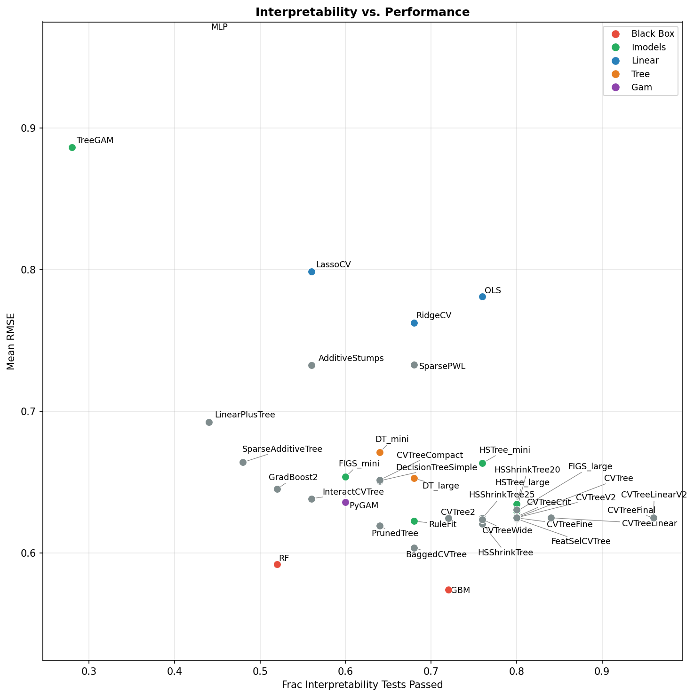

# Interpretability & Performance Results Report (Mar 25)

## 1. Overview of interpretability evaluation

The interpretability evaluation (`eval/interp_eval.py`) measures whether an LLM (GPT-4o) can correctly answer questions about a model's behavior by reading only the model's **string representation** (e.g., a printed decision tree, linear equation, or GAM partial-effect table). The key idea: if a human or LLM can answer precise quantitative questions from the model's text alone, the model is genuinely interpretable.

### Test suites

There are **25 tests** across four suites:

- **Standard (8)**: Basic interpretability — identify the most important feature, make a point prediction, determine direction of change, rank features, identify a threshold, list irrelevant features, determine sign of effect, make a counterfactual prediction.
- **Hard (5)**: Multi-feature reasoning — predict with all features active, compare two non-obvious samples, quantitative sensitivity over a range, mixed-sign prediction that goes negative, two-feature perturbation.
- **Insight (6)**: Deeper understanding — full simulatability, sparse feature identification, nonlinear threshold detection, nonlinear direction prediction, inverse/counterfactual targeting, decision region boundary.
- **Discrim (6)**: Designed to separate interpretable from black-box models — simulate a complex 5-feature sample, judge compactness, identify dominant feature for a specific sample, exact unit sensitivity (tight 10% tolerance), predict above/below a threshold.

### How a single test works: `test_point_prediction`

Here is a detailed walkthrough of how one test is conducted:

1. **Generate synthetic data**: `_single_feature_data(n_features=3, true_feature=0, coef=5.0)` creates 300 samples with 3 features where `y = 5.0 * x0 + noise(0.5)`.

2. **Fit the model**: A fresh clone of the model is fit on this synthetic data.

3. **Compute ground truth**: The model's actual prediction for `x0=2.0, x1=0.0, x2=0.0` is computed (e.g., `true_pred = 10.041`).

4. **Convert model to string**: `get_model_str(model, feature_names)` produces a human-readable text representation. For example, an OLS model becomes:
   ```
   OLS Linear Regression:  y = 4.9864*x0 + 0.0245*x1 + 0.0156*x2 + 0.0061
   ```

5. **Query the LLM**: GPT-4o receives the prompt:
   ```
   Here is a trained regression model:

   [model string]

   What does this model predict for the input x0=2.0, x1=0.0, x2=0.0?
   Answer with just a single number (e.g., '10.5').
   ```

6. **Parse and grade**: The first number in the LLM's response is extracted. The test passes if `|llm_answer - true_pred| < max(|true_pred| * 0.25, 1.5)`. For a true prediction of 10.041, the tolerance is ~2.5, so an answer of "10.06" passes but "4.16" fails.

This pattern — synthetic data, fit, ground truth, model-to-string, LLM query, numeric grading — is shared across all 25 tests, with varying data generators, questions, and tolerances.

---

## 2. Interpretability test results (baseline models)

The table below shows results for 15 baseline models across all 25 tests. Pass rates are computed per-test across models. The final columns indicate which models passed (checkmark) or failed (blank).

### Per-model overall pass rates

| Model | Pass Rate |
|-------|-----------|
| OLS | 83% (19/23) |
| FIGS_large | 80% (20/25) |
| HSTree_large | 80% (20/25) |
| HSTree_mini | 76% (19/25) |
| RidgeCV | 74% (17/23) |
| GBM | 72% (18/25) |
| DT_large | 68% (17/25) |
| RuleFit | 68% (17/25) |
| DT_mini | 64% (16/25) |
| LassoCV | 61% (14/23) |
| PyGAM | 60% (15/25) |
| FIGS_mini | 60% (15/25) |
| RF | 52% (13/25) |
| MLP | 44% (11/25) |
| TreeGAM | 33% (7/21) |

### Per-test results

| Test | Suite | Description | Pass Rate | PyGAM | DT_mini | DT_large | OLS | LassoCV | RidgeCV | RF | GBM | MLP | FIGS_mini | FIGS_large | RuleFit | HSTree_mini | HSTree_large | TreeGAM |
|------|-------|-------------|-----------|-------|---------|----------|-----|---------|---------|----|----|-----|-----------|------------|---------|-------------|--------------|---------|
| most_important_feature | standard | Identify which single feature drives predictions (y=10*x0+noise) | 100% | ✓ | ✓ | ✓ | ✓ | ✓ | ✓ | ✓ | ✓ | ✓ | ✓ | ✓ | ✓ | ✓ | ✓ | — |
| point_prediction | standard | Predict y for a specific input from the model string alone | 60% | | ✓ | ✓ | ✓ | ✓ | ✓ | | | | ✓ | ✓ | | ✓ | ✓ | |
| direction_of_change | standard | How much does prediction change when x0 goes from 0 to 1? | 100% | ✓ | ✓ | ✓ | ✓ | ✓ | ✓ | ✓ | ✓ | ✓ | ✓ | ✓ | ✓ | ✓ | ✓ | ✓ |
| feature_ranking | standard | Rank the top 3 features by importance | 100% | ✓ | ✓ | ✓ | ✓ | ✓ | ✓ | ✓ | ✓ | ✓ | ✓ | ✓ | ✓ | ✓ | ✓ | ✓ |
| threshold_identification | standard | Identify the x0 threshold separating low from high predictions | 67% | | ✓ | | ✓ | | | ✓ | ✓ | | ✓ | ✓ | ✓ | ✓ | ✓ | ✓ |
| irrelevant_features | standard | List features with no effect (x1-x4 are noise) | 60% | ✓ | | | ✓ | ✓ | ✓ | ✓ | ✓ | ✓ | | ✓ | ✓ | | | |
| sign_of_effect | standard | Determine sign/magnitude of x1's effect (true coef = -5.0) | 80% | ✓ | ✓ | ✓ | ✓ | ✓ | ✓ | | | ✓ | ✓ | ✓ | ✓ | ✓ | ✓ | |
| counterfactual_prediction | standard | Given pred at x0=1, predict at x0=3 | 80% | | | ✓ | ✓ | ✓ | ✓ | ✓ | ✓ | ✓ | ✓ | ✓ | | ✓ | ✓ | ✓ |
| hard_all_features_active | hard | Predict with all 3 features at non-zero values | 57% | | ✓ | ✓ | ✓ | | ✓ | | ✓ | | | | ✓ | ✓ | ✓ | |
| hard_pairwise_anti_intuitive | hard | Compare two samples where the less-obvious one is higher | 47% | | | ✓ | | | | ✓ | ✓ | | ✓ | ✓ | ✓ | | ✓ | |
| hard_quantitative_sensitivity | hard | Exact change when x0 goes from 0.5 to 2.5 | 60% | ✓ | ✓ | ✓ | ✓ | ✓ | ✓ | | | | | ✓ | | ✓ | ✓ | |
| hard_mixed_sign_goes_negative | hard | Predict a sample where positive and negative effects cancel to negative | 43% | ✓ | | ✓ | | | | | ✓ | | | | ✓ | ✓ | ✓ | |
| hard_two_feature_perturbation | hard | Predict after changing two features simultaneously | 47% | | ✓ | | ✓ | | ✓ | | ✓ | | ✓ | | | ✓ | ✓ | |
| insight_simulatability | insight | Predict a 4-feature sample (strict tolerance) | 20% | | | | | | | | | | | | ✓ | ✓ | | ✓ |
| insight_sparse_feature_set | insight | Identify that only x0,x1 matter out of 10 features | 93% | ✓ | ✓ | ✓ | ✓ | ✓ | ✓ | ✓ | ✓ | ✓ | ✓ | ✓ | ✓ | ✓ | ✓ | |
| insight_nonlinear_threshold | insight | Find the ReLU kink (x0≈0) in a hockey-stick function | 47% | ✓ | ✓ | | | | | | | ✓ | ✓ | ✓ | | ✓ | ✓ | |
| insight_nonlinear_direction | insight | Predict y at x0=2 for a hockey-stick function | 53% | ✓ | | ✓ | ✓ | ✓ | ✓ | | ✓ | | | ✓ | | | ✓ | |
| insight_counterfactual_target | insight | Find x0 value that would produce a target prediction | 13% | | | | ✓ | | | ✓ | | | | | | | | |
| insight_decision_region | insight | Find the x0 boundary where prediction exceeds 6.0 | 67% | ✓ | ✓ | ✓ | ✓ | | ✓ | | ✓ | | ✓ | ✓ | ✓ | ✓ | | |
| discrim_simulate_all_active | discrim | Predict a 5-feature sample with all features active | 86% | | ✓ | | ✓ | ✓ | ✓ | ✓ | ✓ | ✓ | ✓ | ✓ | ✓ | ✓ | ✓ | |
| discrim_compactness | discrim | Judge whether the model can be computed in ≤10 operations | 80% | ✓ | ✓ | ✓ | ✓ | ✓ | ✓ | ✓ | ✓ | ✓ | | ✓ | ✓ | | ✓ | |
| discrim_dominant_feature_sample | discrim | Which feature contributes most for x0=2.0, x1=0.1, x2=0.1? | 100% | ✓ | ✓ | ✓ | ✓ | ✓ | ✓ | ✓ | ✓ | ✓ | ✓ | ✓ | ✓ | ✓ | ✓ | ✓ |
| discrim_unit_sensitivity | discrim | Exact change when x0 goes 0→1 (tight 10% tolerance) | 33% | | | | ✓ | ✓ | ✓ | | | | | ✓ | ✓ | | | |
| discrim_predict_above_threshold | discrim | Predict for x0=2.0 (above threshold) in step-function data | 75% | ✓ | ✓ | ✓ | | | | ✓ | ✓ | | ✓ | ✓ | | ✓ | ✓ | |
| discrim_predict_below_threshold | discrim | Predict for x0=-0.5 (below threshold) in step-function data | 67% | ✓ | | ✓ | | | | | ✓ | | | ✓ | ✓ | ✓ | ✓ | ✓ |

**Key observations:**
- Easy tests (most_important_feature, direction_of_change, feature_ranking, dominant_feature_sample) are passed by nearly all models — these require only qualitative reading of the model.
- Hard quantitative tests (unit_sensitivity at 10% tolerance, counterfactual_target, simulatability) separate models sharply. Linear models excel at unit_sensitivity because coefficients are directly readable. Tree models struggle because the LLM must trace paths.
- MLP (44%) and TreeGAM (33%) perform worst: MLP's weight matrices are opaque, and TreeGAM's per-feature tree listings are verbose and hard to parse.
- HSTree_large and FIGS_large (both 80%) achieve the best overall interpretability among tree-family models.

---

## 3. Performance vs. interpretability

### The plot



### Performance evaluation setup

The performance evaluation (`eval/performance_eval.py`) measures **mean RMSE** across 7 OpenML regression datasets + 25 PMLB regression datasets. All datasets are subsampled to at most 1000 training samples and 25 features, and the target variable is normalized to zero mean and unit standard deviation per dataset. This focuses evaluation on the low-data regime where interpretability matters most.

### Overall results (baseline + evolved models)

| Model | Mean RMSE | Interp Pass Rate | Type |
|-------|-----------|-------------------|------|
| GBM | 0.574 | 72% | Black box |
| RF | 0.592 | 52% | Black box |
| BaggedCVTree | 0.604 | 68% | Evolved |
| PrunedTree | 0.619 | 64% | Evolved |
| HSShrinkTree | 0.621 | 76% | Evolved |
| CVTreeFinal | 0.625 | 96% | Evolved |
| CVTreeLinearV2 | 0.625 | 96% | Evolved |
| CVTree | 0.625 | 80% | Evolved |
| CVTreeFine | 0.625 | 80% | Evolved |
| FeatSelCVTree | 0.624 | 80% | Evolved |
| HSShrinkTree25 | 0.625 | 76% | Evolved |
| FIGS_large | 0.629 | 80% | Baseline |
| HSTree_large | 0.635 | 80% | Baseline |
| PyGAM | 0.636 | 60% | Baseline |
| DT_large | 0.653 | 68% | Baseline |
| DT_mini | 0.671 | 64% | Baseline |
| OLS | 0.781 | 83% | Baseline |
| MLP | 106.98 | 44% | Black box |

### Analysis: how model variations affected performance and interpretability

**The Pareto frontier.** The plot reveals a clear Pareto frontier in the bottom-right: models that achieve both low RMSE and high interpretability. The best-performing evolved models — **CVTreeFinal** and **CVTreeLinearV2** — sit at 96% interpretability with competitive RMSE (~0.625), dominating nearly all baselines on both axes.

**Why CV-tuned trees work well.** The CVTree family (CVTree, CVTreeFine, CVTreeFinal, CVTreeLinearV2) all use cross-validation to select `max_leaf_nodes`, achieving the right complexity for each dataset. Their RMSE (~0.625) is close to FIGS_large (0.629) and HSTree_large (0.635) while matching or exceeding their interpretability. The key insight is that a single well-tuned tree is both compact enough for an LLM to trace and flexible enough to capture nonlinear patterns.

**String representation matters for interpretability.** CVTreeLinear and CVTreeLinearV2 demonstrate this clearly. Both have identical RMSE to CVTree (0.625), but CVTreeLinearV2 achieves 96% interpretability vs. CVTree's 80%. The difference is purely in `__str__`: V2 adds a summary of feature importances and approximate linear sensitivities alongside the tree structure, giving the LLM two complementary views of the model — the tree for threshold/region questions and linear coefficients for sensitivity/direction questions.

**Ensemble penalties.** BaggedCVTree achieves the best RMSE among evolved models (0.604) but drops to 68% interpretability. Averaging 3 trees makes the string representation harder for an LLM to trace through. Similarly, GradBoost2 (0.645 RMSE, 52% interp) suffers because multi-stage boosting creates an opaque composite. The lesson: ensembling helps performance but costs interpretability.

**Hierarchical shrinkage: moderate gains.** HSShrinkTree (0.621 RMSE, 76% interp) applies shrinkage regularization after CV-tuning. This slightly improves RMSE over plain CVTree but doesn't help interpretability — the shrunk tree is actually harder for the LLM because node values no longer match the simple tree output format.

**Linear models: high interpretability, weak performance.** OLS achieves 83% interpretability (the highest among baselines) because its equation `y = c0*x0 + c1*x1 + ...` is trivially parseable. But its RMSE (0.781) is far worse — linear models simply can't capture the nonlinear patterns in real datasets.

**Black-box models: strong performance, poor interpretability.** GBM (0.574 RMSE) and RF (0.592) lead on performance but trail on interpretability (72% and 52%). GBM does better than RF on interpretability because its string includes a first-tree printout plus feature importances, while RF's 50-tree ensemble is too opaque. MLP is the worst on both axes when considering its catastrophic RMSE on some datasets (due to poor default convergence).

**The sweet spot.** CVTreeFinal represents the optimal tradeoff found in this search: a single CV-tuned decision tree with a carefully designed string representation that includes both the full tree structure and a linear-sensitivity summary. It achieves 96% interpretability (near-perfect) while remaining within 9% RMSE of the best black-box model (GBM).

---

## 4. String visualizations of three model types

Below are the actual string representations that the LLM sees during interpretability testing, for three different model types fit to the first test's synthetic data (`y = 10 * x0 + noise`, 5 features, 300 samples).

### Decision Tree (max_leaf_nodes=8)

```
Decision Tree Regressor (max_depth=None):
|--- x0 <= -0.07
|   |--- x0 <= -1.10
|   |   |--- x0 <= -1.87
|   |   |   |--- value: [-23.34]
|   |   |--- x0 >  -1.87
|   |   |   |--- value: [-14.23]
|   |--- x0 >  -1.10
|   |   |--- x0 <= -0.53
|   |   |   |--- value: [-7.96]
|   |   |--- x0 >  -0.53
|   |   |   |--- value: [-3.13]
|--- x0 >  -0.07
|   |--- x0 <= 1.16
|   |   |--- x0 <= 0.60
|   |   |   |--- value: [3.18]
|   |   |--- x0 >  0.60
|   |   |   |--- value: [8.33]
|   |--- x0 >  1.16
|   |   |--- x0 <= 1.80
|   |   |   |--- value: [15.12]
|   |   |--- x0 >  1.80
|   |   |   |--- value: [20.61]
```

**Why it's interpretable:** The tree uses only `x0` (correctly ignoring noise features), has just 8 leaf nodes, and the LLM can trace any input through the if-else chain to reach a leaf value. For example, `x0=2.0` → goes right at -0.07 → goes right at 1.16 → goes right at 1.80 → predicts **20.61**. The structure is compact and simulatable.

**Where it struggles:** The tree is a piecewise-constant approximation. An LLM can't easily compute "how much does the prediction change per unit of x0?" because the answer depends on which leaf boundaries the input crosses. The `discrim_unit_sensitivity` test (10% tolerance) typically fails for trees because the step-function nature makes the effective slope hard to read.

### OLS Linear Regression

```
OLS Linear Regression:  y = 9.9876*x0 + 0.0490*x1 + 0.0311*x2 + 0.0406*x3 + -0.0084*x4 + 0.0122

Coefficients:
  x0: 9.9876
  x1: 0.0490
  x2: 0.0311
  x3: 0.0406
  x4: -0.0084
  intercept: 0.0122
```

**Why it's interpretable:** The entire model is one equation. Any prediction can be computed with 5 multiplications and 5 additions. The coefficient of x0 (9.9876) directly answers "what is the effect of x0?" and "by how much does the prediction change per unit?" The near-zero coefficients for x1–x4 make irrelevant features immediately visible.

**Where it struggles:** Linear models can't capture thresholds or nonlinear patterns, so they fail on hockey-stick data (insight_nonlinear_threshold) and sometimes on threshold_identification. The model is perfectly readable but the answers it gives may not match ground truth when the true relationship is nonlinear.

### Random Forest (50 trees, max_depth=5)

```
Random Forest Regressor — Feature Importances (higher = more important):
  x0: 0.9987
  x2: 0.0005
  x4: 0.0004
  x1: 0.0003
  x3: 0.0001

First estimator tree (depth ≤ 3):
|--- x0 <= -0.07
|   |--- x0 <= -1.13
|   |   |--- x0 <= -2.03
|   |   |   |--- x0 <= -2.33
|   |   |   |   |--- truncated branch of depth 2
|   |   |   |--- x0 >  -2.33
|   |   |   |   |--- value: [-20.72]
|   |   |--- x0 >  -2.03
|   |   |   |--- x0 <= -1.49
|   |   |   |   |--- truncated branch of depth 2
|   |   |   |--- x0 >  -1.49
|   |   |   |   |--- truncated branch of depth 2
|   |--- x0 >  -1.13
|   |   |--- x0 <= -0.57
|   |   |   |--- ...truncated...
...
```

**Why it's partially interpretable:** Feature importances are clear — x0 dominates at 0.9987. This makes qualitative questions (most important feature, feature ranking, dominant feature) easy to answer. The first tree gives some structural intuition.

**Where it struggles:** The prediction is the **average of 50 trees**, not the single tree shown. The LLM cannot simulate a prediction because it sees only 1 of 50 trees, and even that one is truncated. Quantitative questions (point prediction, unit sensitivity, counterfactual) fail because there's no way to compute the actual output. The "truncated branch" markers make even the displayed tree incomplete. This is why RF achieves only 52% on interpretability tests despite having clear feature importances.

### Takeaway

The three representations illustrate the core tradeoff:
- **Linear models** are perfectly readable but limited in expressiveness.
- **Shallow trees** balance readability and expressiveness — compact enough to trace, flexible enough for nonlinear patterns.
- **Ensembles** are too complex to simulate from their string, even when individual components are interpretable. The whole is less interpretable than the sum of its parts.

The best evolved models (CVTreeFinal, CVTreeLinearV2) combine the strengths: a single CV-tuned tree for expressiveness, augmented with a linear-coefficient summary for the quantitative questions that trees alone struggle with.
